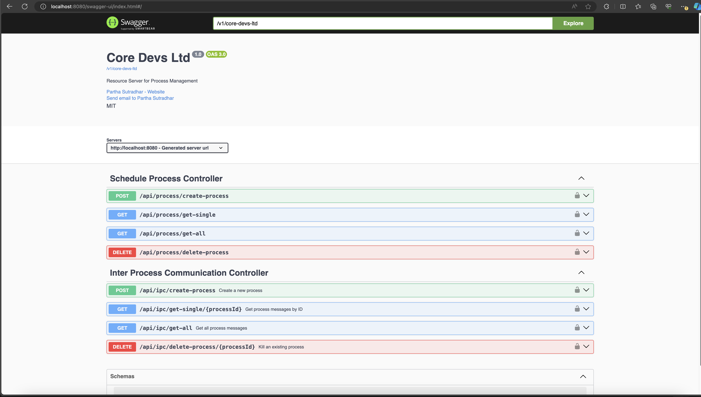
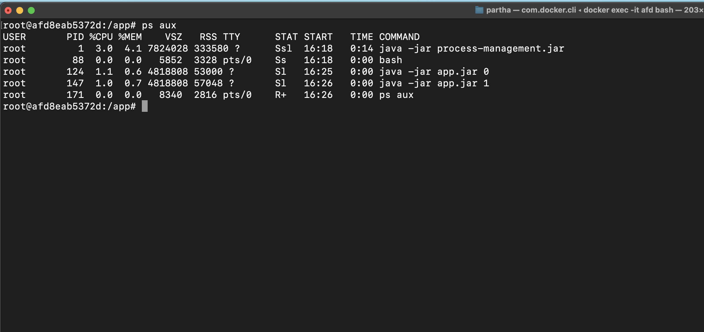

# Process Management - Process WatchDog 

# Start 
```shell
docker-compose up -d
```

## API: http://localhost:8080/swagger-ui/index.html

# Stop
```shell
docker-compose down -v
```

# Docker Exec 

In theory there is no direct access not process memory and they have independent memory space. So, used a common filesystem memory store to communicate with each other. (IPC) Pipestream would be better for optimum communication.

Use in the container to check process
```shell
docker exec -it <container_id> bash
ps aux
```

# Screen Shot


# Docker Container


### App.jar is a simple Java Jar of this file to log the process.
// capture output stream to process-manegement app.

```java
public class Driver {
    public static void main(String[] args) throws InterruptedException {
        if (args.length >= 1) {
            while (true) {
                // capture output stream to process-manegement app.
                System.out.println("Hello Core Devs Ltd. Process Id : " + args[0] + " Time : " + new Date()); 
                Thread.sleep(1000);
            }
        }
    }
}
```
